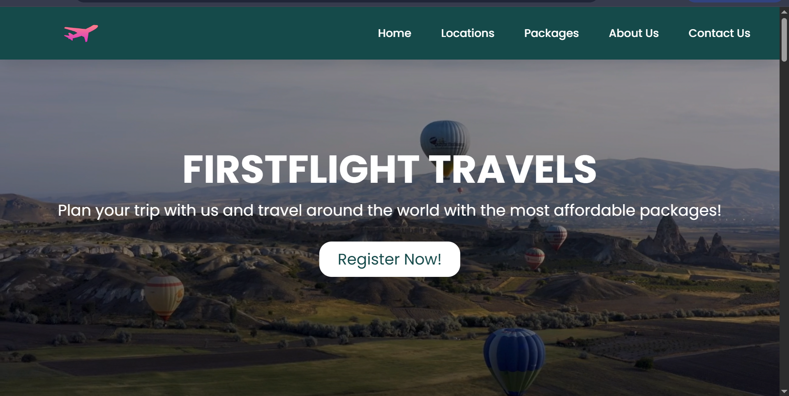
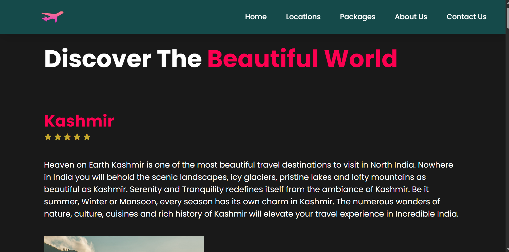
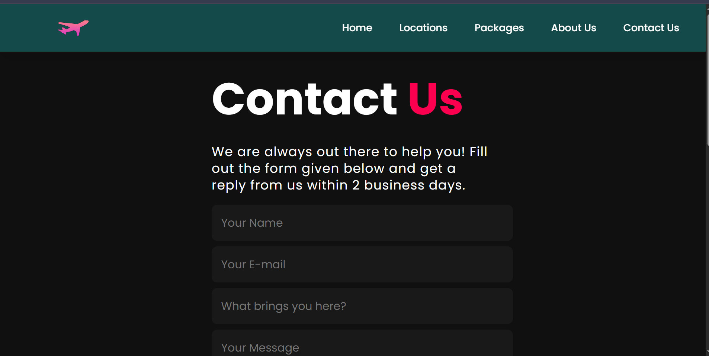

## 🌍 Tourist Media Hub
A **modern, responsive tourism media website** showcasing popular travel destinations, curated galleries, and seamless contact for tour planning. Built using **HTML, CSS, and JavaScript** with clean UI/UX design for an engaging user experience.

## 🚀 Live Demo
View the Live Site Here (https://divyasisodia165.github.io/tourist-media-hub/)

## 📌 Key Features
- 🎨 **Clean & Responsive UI:** Adapts seamlessly across desktop, tablet, and mobile.
- 🗺️ **Destinations Showcase:** Engaging display of top travel destinations with visuals.
- 🖼️ **Interactive Gallery:** Sliders and galleries showcasing beautiful spots.
- ✉️ **Contact Form:** Simple, functional booking inquiry form.
- ✨ **Smooth Animations:** Fade-ins, hover effects, and transitions.
- ⚡ **Fast Performance:** Optimized structure for quick load times.

## 🛠️ Tech Stack
- **Frontend:** HTML, CSS, JavaScript
- **Deployment:** GitHub Pages

## 📸 Screenshots

### 🏠 Home Page

### 🌄 Destinations Section

### 📷 Gallery Section

### ✉️ Contact Form

## 🗂️ Project Structure
Tourist Media Hub/
│
├── index.html
├── about.html
├── contact.html
├── styles/
│ └── style.css
├── scripts/
│ └── main.js
└── images/
└── [image files]

## 🤝 Contributions are welcome!

Fork this repository.
Create a new branch (feature-branch).
Commit your changes with clear messages.
Push and open a Pull Request.

## 📧 Contact
Developed with ❤️ by Divya Sisodia
GitHub: divyasisodia165
Email: sisodiadivya637@gmail.com

## ⭐ Acknowledgements
Free-to-use images and icons for UI.
Inspired by modern travel websites for educational learning.
